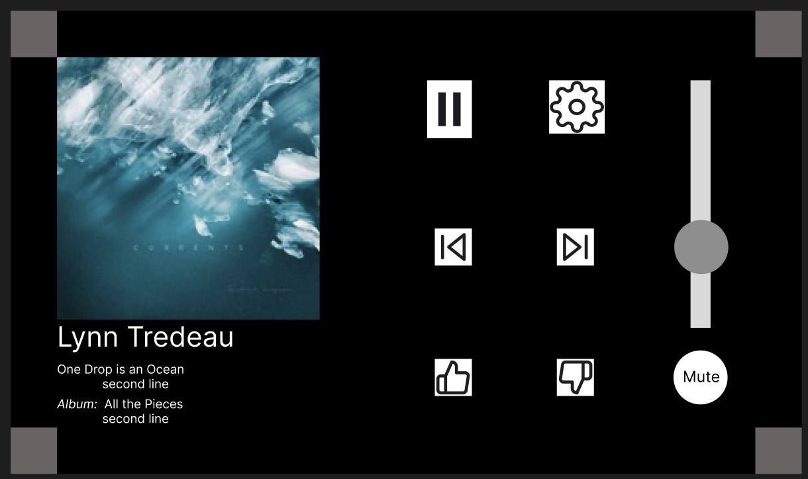

# System Design Document: Pi Music Player
Mitchell Kolb

## Table of Contents
- [Outline](#outline)
- [Notes of Program](#notes-of-program)
- [Rough GUI Idea](#gui-layout-idea)
- [Functional Requirements](#functional-requirements)
- [Nonfunctional Requirements](#nonfunctional-requirements)

## Outline

## Notes of Program
- On startup the raspberry pi launches the GUI
- GUI
    - WINDOW 1 (Startup)
        - "start" button to begin the web automation 
        - "quit" button to shutdown the gui and return to the desktop
        - "restart" button to restart the PI
        - "update" to pull the latest version from the repo and restart the gui
    - WINDOW 2 (Music Player)
        - "Settings" button
            - To shutdown/quit the gui and return to the desktop
            - Restart raspberry pi
        - "Play" button 
            - When pressed the web automation presses the play button on the website to play the music
            - When pressed the button alternates to the pause icon and takes on the pause functionality
        - "Pause" button 
            - When pressed the web automation presses the pause button on the website to pause the music
            - When pressed the button alternates to the play icon and takes on the play functionality
        - "Volume Slider" button 
            - A number incrementer that has like 5 options it locks to and when it does presses a certain point on the website slider.
            - This slider could also just be connected to system audio settings and keep the website volume on max but just adjust the system volume
        - "Thumbs Up" button 
            - When pressed the web automation presses the thumbs up button on the website to thumbs up the current track
        - "Thumbs Down" button
            - When pressed the web automation presses the thumbs down button on the website to thumbs down the current track
 
- Automation
    - Open either a headless browser instance or a rendered browser that is imediately shifted out of focus
    - Logs into the painostream.com
        - Store Username and pass in a env file that is only saved locally on the instance.
        - Once logged in render the desktop version of the site if needed
        - Press play to begin the songs list and button actions can connect to the rendered items
    - Save the Song image, title, artist
        - The information comes the site that is displayed on the GUI

## GUI Layout Idea
This is a rough idea I made in figma that I will try and follow for the gui on the raspberry pi

## Functional Requirements
- The system must be hands off from the raspberry pi boot up
    - When the power is plugged in the system will turn on so we can use that as a On/Off switch
    - When power is on the The GUI must launch in kiosk mode (full-screen, without window borders or OS distractions) on the connected 5-inch touchscreen display.
- Music Playback
    - The system must connect to PianoStream via a browser instance controlled by Playwright.
    - Music playback should begin automatically upon startup or after the user selects their desired station from the custom GUI.
- Custom GUI Audio Controls
    -  The PyQt-based GUI must provide intuitive controls for: Play/Pause, Adjusting volume, and Navigating between tracks or stations
    - Controls should visually update to reflect the current playback status (e.g., muted, paused).
    - The GUI must communicate with Playwright to control browser-based playback.
- Connectivity
    - The system must connect to a Wi-Fi network automatically upon boot to enable access to PianoStream.
    - Provide a fallback mechanism for configuring Wi-Fi credentials if the initial setup fails.

## Nonfunctional Requirements
- Modular Design: The system must be designed in a modular fashion to allow individual components (e.g., PyQT GUI, Playwright browser automation, power control logic) to be updated or replaced without affecting the overall functionality.
- Documentation: Comprehensive documentation must be provided for hardware setup, software dependencies, configuration files, and codebase structure to facilitate troubleshooting and upgrades.
- Dependency Management: Python libraries and Rust modules must be version-locked using tools like pip freeze or a requirements.txt file to ensure compatibility during updates or reinstallation.
- Configuration Files: All system settings (e.g., kiosk mode, screen resolution, browser preferences) should be stored in external configuration files to enable easy adjustments without modifying the codebase.

